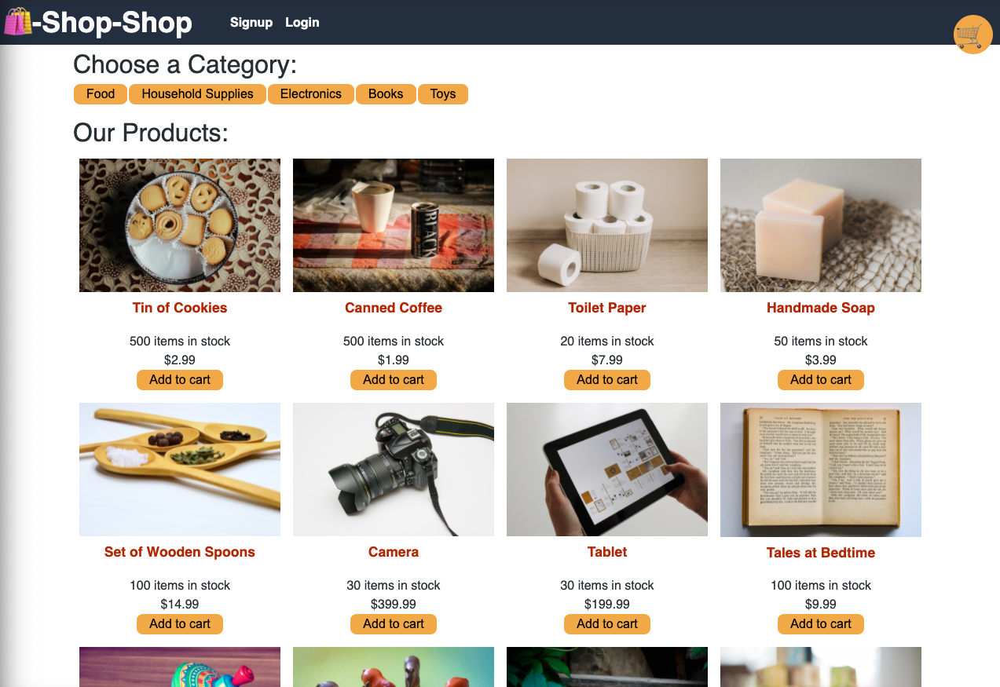

# Redux-Store
State Challenge: Redux Store

## Discription
A full stack web application using the MERN Stack to create an e-commerce website using React and Redux with Stripe payments. Users will be able to checkout when there is lost of connection and view their order history out of checkout. Users will also be able to sign up and login in to their account.

## Screenshot

## Demo
[Live Demo](https://lit-journey-61823.herokuapp.com/)

## Contributors
Github: [Tima Nlemvo](https://github.com/timanlemvo)

## Questions
Github: [Tima Nlemvo](https://github.com)  
Email: [Tima Nlemvo](timanlemvo@gmail.com)

“Whether you want to uncover the secrets of the universe, or you just want to pursue a career in the 21st century, basic computer programming is an essential skill to learn.”

-- Stephen Hawking
